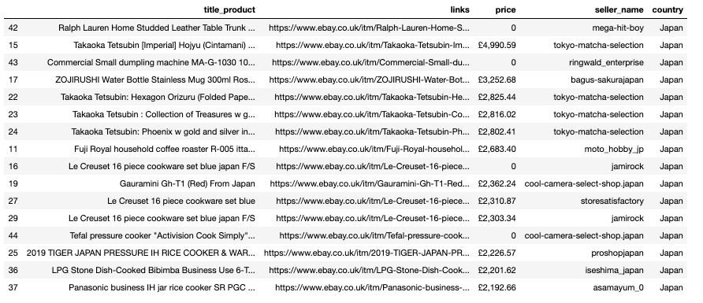

# Linkedin scrape using Selenium(Python)
https://www.youtube.com/watch?v=G_zMNPN1Vc0

# Content-Based Book Recommendation Engine in Python and Voilla.
https://www.youtube.com/watch?v=Em5jYkq_XbY

Calculate the similarity between all the books using cosine similarity.

# Scraping data from ebay.com
For my client from Japan I scraped data from *ebay* using Python module **requests** and **lxml**.
Output - csv.file

Sample output in **Pandas** dataframe.

# Scraping data from IMBD.com 

https://youtu.be/qJh9UWZHBD4

